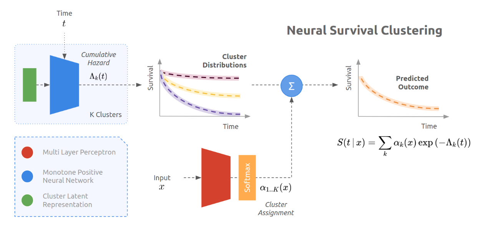

# CSE6250-Final-Project 
Replicate the Neural Survival Cluster model.
This is a CSE6250 Final project repo to reproduce the results in [Neural Survival Clustering: Non parametric mixture of neural networks for survival clustering](https://proceedings.mlr.press/v174/jeanselme22a/jeanselme22a.pdf)

## Model
The model consists in a mixture of K neural networks that model different population-level survival distributions, and an assignment neural network that weights these different mixtures given the input data. 

## How to use the replication and reproduction code?
Step 1: Download the whole repo 

Step 2: Upload the whole /NeuralSurvivalClustering folder to your Google Drive 

Step 3: Make sure the /NeuralSurvivalClustering folder is under /content/gdrive/My Drive

Step 4: Go to the folder named /Experiments

Step 5: Open the notebook "Neural Survival Clustering on SUPPORT Dataset.ipynb" or "Neural Survival Clustering on METABRIC Dataset.ipynb"

Step 6: Run the notebook code. 

# Setup
## Structure
We followed the same structure of the [DeepSurvivalMachines](https://github.com/autonlab/DeepSurvivalMachines) repository.
Running the .ipynb files will complete the setup of the environment and path dependencies. 

## Requirements
Standard Google Colab environment. 
Running the .ipynb files will complete the setup of the environment and path dependency requirements. 
